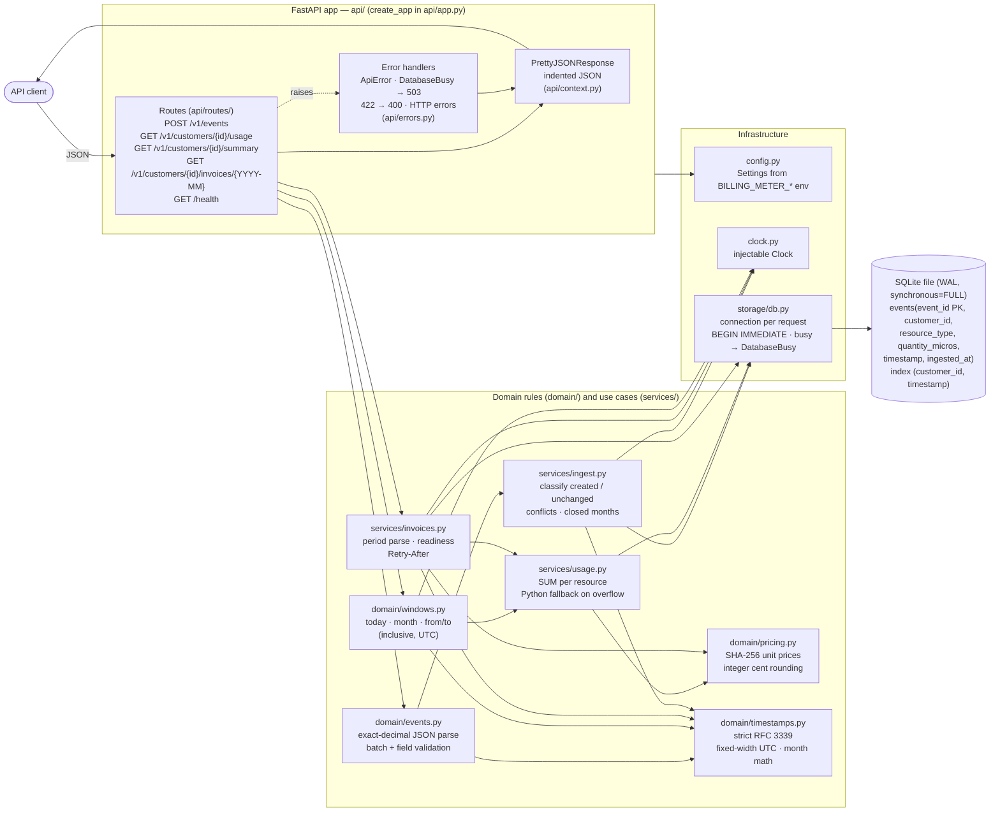
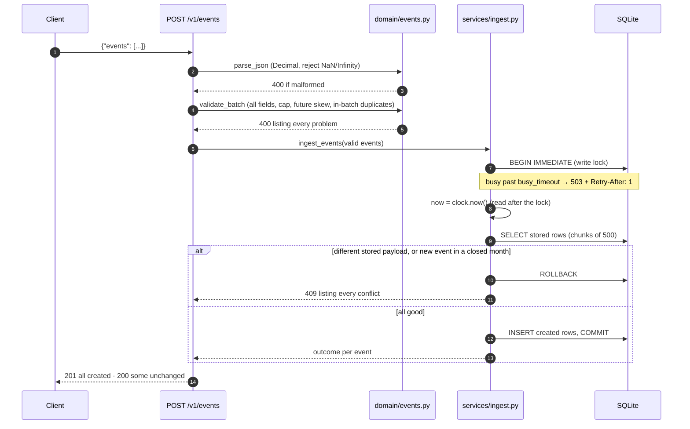
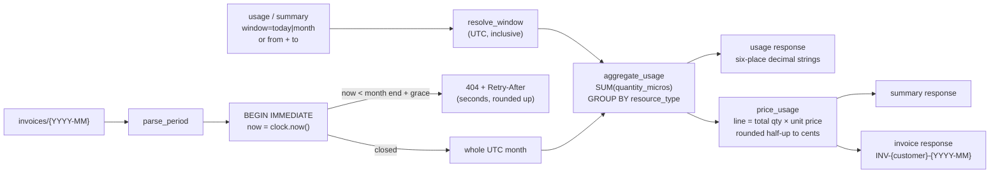
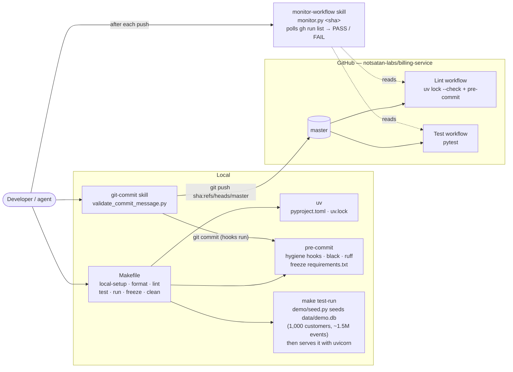

# billing-meter — Architecture

## Runtime components

`main.py` builds the app with `create_app()` (settings from the environment, system clock). Tests call `create_app(settings, clock)` with a temporary database and a frozen clock.

## Ingesting a batch

## Reading usage, summaries and invoices

Invoices are never stored. Events are immutable, closed months accept no new events, and prices are a pure function of the resource name, so every fetch of a closed month returns identical content.

## Development and delivery

Each pushed commit gets its own monitor. Polling is sized so three concurrent monitors (a soft target, not a cap) stay well under GitHub's API rate limit.
